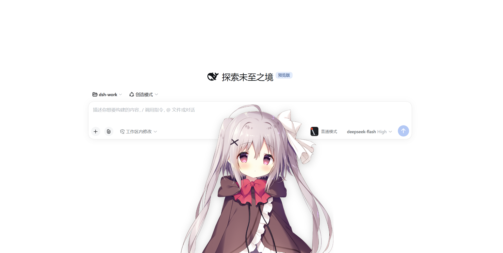
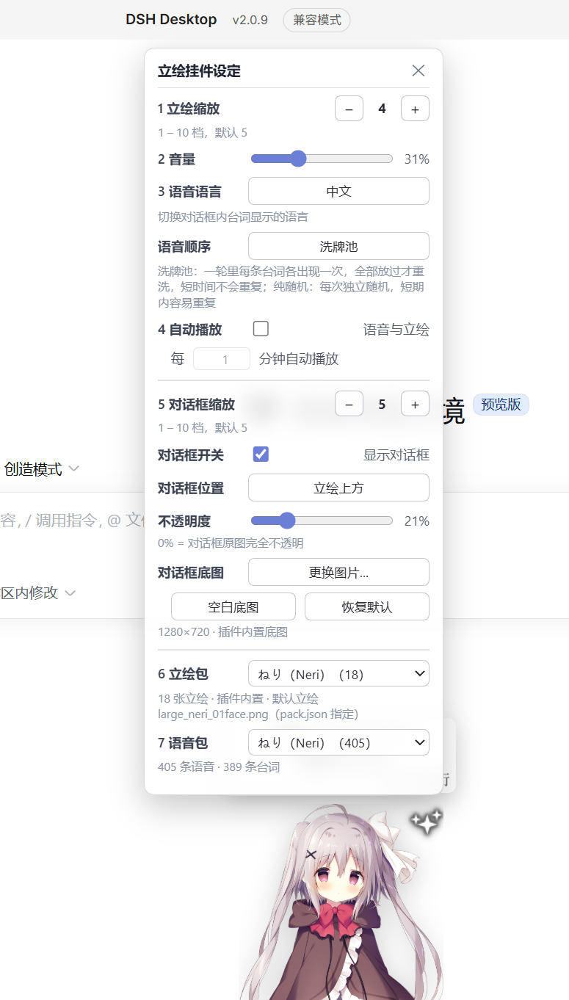

> **该插件架构基本完善，如dsh无破坏性更新，此插件长期可用，语音包持续更新ing**

# dsh-gal · DSH 立绘挂件



> 在 **DeepSeek Harness** 界面里放一个会说话的立绘：实时显示 **DeepSeek 余额** 与 **今日已用**，
> 每轮对话结束报出本轮 **消耗与花费**，点击立绘**随机播放语音、随机换立绘**。
>
> 立绘包、语音包、图标、对话框都是普通文件夹，可以自己换。



## 功能

| 功能 | 说明 |
|---|---|
| 实时余额 | 官方余额接口，60 秒刷新；失败时保留上一次的值 |
| 今日已用 | 优先官方用量接口；没有平台令牌时用「余额差额记账」推算 |
| 每轮消耗 | 监听会话事件流，按 `(会话, 轮次)` 聚合真实 usage，对话结束即结算（**重启后的第一条也会弹**） |
| 点击立绘 | 随机语音 + 随机立绘 + 台词以打字机效果逐字显示、居中（字号自适应，短句最多 28px） |
| 语音顺序 | 默认**洗牌池**：一轮里每条台词各出现一次，全部放过才重洗，短期内不会重复；可切成**纯随机** |
| 没有内容表时 | 该语音**没有台词可显示**，对话框改为显示「余额 / 今日已用」；语音与随机立绘照常 |
| 点击对话框 | 整块切成「余额 / 今日已用」，并把消失倒计时重置为 `dialogHoldSeconds`（默认 3 秒，**无音效**） |
| 自动消失 | **语音播完后**停留 3 秒再淡出（可配 `dialogHoldSeconds`）；本轮收据固定停 5 秒 |
| 回归默认立绘 | 对话框消失后切回立绘包的默认立绘（可配 `spriteRevertOnHide`） |
| 自动播放 | 可设定每 X 分钟自动换立绘 + 播语音（默认关闭） |
| 拖拽 / 缩放 | 立绘与对话框各 1–10 档，用 `−` / `+` 按钮调，默认 5 档 |
| 对话框底图 | 设定面板里一键换图：`更换图片…` 选自己的图，`空白底图` 换成自带的纯白面板，`恢复默认` 还原；**换完立即生效**，不用重启 |
| 多包管理 | 立绘包与语音包**分别**选择，可以「A 的立绘 + B 的语音」 |

## 安装

**前置**：已在 DSH 里配置好 `DEEPSEEK_API_KEY` 凭据。

到 **[Releases](https://github.com/strawberry0321/dsh-gal/releases/latest)** 下载 `dsh-gal.tgz`
（不带版本号的那个，永远指向最新版），然后按本地文件安装：

```powershell
dsh plugin --profile desktop add C:\path\to\dsh-gal.tgz
```

**必须重启 DSH Desktop**：宿主路由和注入脚本在进程启动时装配，只刷新页面不够。

> **用网页端（`npx @deepseek-ai/dsh web`）的话**，把命令里的 `--profile desktop` 换成
> `--profile web` —— 网页端读的是 `web` profile，装到 `desktop` 里网页端**看不到挂件**
> （宿主路由不会注册，页面里也不会注入脚本）。两个 profile 各自维护自己的插件，
> **两端都想用就两端各装一次**；素材包、设置、余额记账是共用的（都在 `%USERPROFILE%\.dsh` 下）。

```powershell
# 验证：配置树里应该出现这一行
dsh --profile desktop --dump-config | Select-String dsh-gal

# 卸载（会同时清掉 dependencies 和 bundles 两处记录）
dsh plugin --profile desktop remove dsh-gal
```

## 使用

| 操作 | 结果 |
|---|---|
| **点击立绘** | 随机语音 + 随机立绘 + 台词逐字显示；语音播完后 3 秒淡出 |
| **点击立绘（语音包没有内容表）** | 语音照常播、立绘照常换，对话框显示「余额 / 今日已用」；同样等语音播完再计时 |
| **点击对话框** | 切成「余额 / 今日已用」，倒计时重置为 `dialogHoldSeconds`（默认 3 秒） |
| **拖动立绘** | 移动挂件，位置自动保存（改窗口大小也不跑偏） |
| **悬浮立绘** | 右上角淡入 ⚙ 设定按钮 |
| **一轮对话结束** | 对话框自动弹出，显示「消耗 128.5K token」「花费 ￥0.28」（黑色、居中、停 5 秒）；不播语音、不换立绘 |

> 位移小于 5px 算点击，超过算拖拽。打字中再次点击会打断当前这句、直接开始下一句。

## 设定面板

点 ⚙ 弹出（半透明白色，默认在立绘上方）。共 7 组：

| # | 项目 | 默认 | 说明 |
|---|---|---|---|
| 1 | 立绘缩放 | 5 档 | 1–10 档，`−` / `+` 按钮 |
| 2 | 音量 | 50% | 0–100% |
| 3 | 语音语言 | 日文 | 点击在「日文 / 中文」间切换，只影响台词文字 |
| 4 | 自动播放语音 | 关闭 | 打开后可设「每 X 分钟」自动播放，默认 1 分钟 |
| 5 | 对话框 | 5 档 / 开启 / 上方 / 0% | 缩放（1–10 档）、开关、位置（上方或下方）、不透明度 |
| 6 | 立绘包 | neri | 下拉选择，切换后立即随机抽一张 |
| 7 | 语音包 | neri | 下拉选择，**可以和立绘包不同** |

「对话框」一组里还有 **对话框底图**：`更换图片…` 挑一张自己的图（PNG / JPEG / WebP / GIF），
`空白底图` 换成随插件自带的纯白面板，`恢复默认` 还原成自带立绘。三者都**立即生效**，
不必重启 DSH；想微调裁切和留白就改 `ui\dialog.json`（见
[docs/customize.md](docs/customize.md)）。

「3 语音语言」下面还有 **语音顺序**：`洗牌池`（默认）/ `纯随机`，点一下切换，立刻生效。
想让某几句多放或少放，在语音包目录里放一个 `weights.json`（见
[docs/customize.md](docs/customize.md)）。

## 自定义立绘包 / 语音包

把文件夹放进用户目录（升级不会被覆盖），设置面板里就会多出这个选项：

```
%USERPROFILE%\.dsh\dsh-gal\packs\
└── mychar\
    ├── sprites\   01.png  02.png ...     ← 立绘
    ├── voices\    my0001.wav ...         ← 语音
    ├── script.csv                        ← 可选：语音 → 台词对照表
    └── pack.json                         ← 可选：显示名 / 默认立绘 / 裁切
```

* 两个文件夹也可以叫 `立绘\` / `语音\`（或 `立ち絵\` / `ボイス\`），插件都认，不用改名。
* 只放 `sprites\` 就是立绘包，只放 `voices\` 就是语音包。
* 语音包**不放 `script.csv`** 就是「只有语音没有台词」：点击立绘照常出声、照常换立绘，
  对话框改为显示「余额 / 今日已用」。
* 立绘的透明边距会**自动裁掉**，不需要自己切图。
* **默认立绘**：由 `pack.json` 的 `defaultSprite` 指定；没写就按自然顺序自动选第一张
  —— 所以任何立绘包都一定有默认立绘，什么配置都不写也能用。

完整格式（`script.csv` 列名、`pack.json` 字段、换对话框底图、定价表）见
**[docs/customize.md](docs/customize.md)**。

## 文档

| 文档 | 内容 |
|---|---|
| [docs/usage.md](docs/usage.md) | 对话框的三张内容页、字号自适应、位置自适应规则、更多 FAQ |
| [docs/customize.md](docs/customize.md) | 素材包完整格式、`dialog.json`、定价表、全部配置项 |
| [docs/development.md](docs/development.md) | 余额/花费算法、HTTP 接口、两类自检、打包发布、目录结构 |

## 疑难

* **点了立绘没声音、或者立绘不换图 / 设定里换立绘包没反应**：都是同一个原因 ——
  页面繁忙时浏览器会饿死**低优先级的图片和媒体请求**（实测 `stalled` 十秒以上，
  一发消息就一起放行，所以症状看起来像「要聊一句才生效」）。
  现在语音、立绘、对话框底图、设定图标都先用 `fetch` 取字节，再交给 `blob:` 播放 / 渲染；
  取不到字节就退回原来的直连方式，不会白屏也不会静音。
  控制台里出现 `[dsh-gal] …字节读取失败` 或 `语音播放被拒绝` 就是这条路径在报错，欢迎带日志提 issue。

## 角色

| 角色 | 默认立绘 | 获取方式 |
|---|---|---|
| **neri** |  | 随插件自带 |
| **Mashiro 精简版** |  | [Releases](https://github.com/strawberry0321/dsh-gal/releases/latest) 的 `mashiro-pack.zip` |
| **noir音效** |  | [Releases](https://github.com/strawberry0321/dsh-gal/releases/latest) 的 `noir-pack.zip` |
| **Karuha** |  | [Releases](https://github.com/strawberry0321/dsh-gal/releases/latest) 的 `karuha-pack.zip` |

下载解压到 `%USERPROFILE%\.dsh\dsh-gal\packs\`，刷新页面即可在设定面板的「立绘包 / 语音包」里选用。

**Mashiro 有两份**：

* `mashiro-pack.zip` —— **精简版**（推荐）：37 张立绘 + 135 条语音，台词逐条筛过。
* `mashiro-pack-full.zip` —— 完整版：**原台词过于伤感，不建议使用**，296 条语音原样留存。
  包 id 是 `Mashiro-full`，和精简版可以同时装，在设定面板里分开选。


